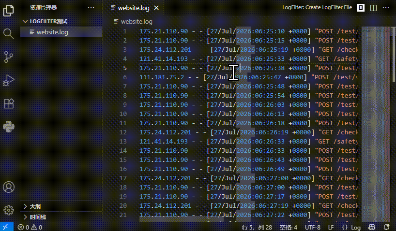

# LogFilter

[](https://marketplace.visualstudio.com/items?itemName=zhanwangfeng.LogFilterPro)
[](https://marketplace.visualstudio.com/items?itemName=zhanwangfeng.LogFilterPro)

[English](README.md) | **中文**

基于管道的 VS Code 日志过滤插件。编写 `.lf` 规则文件来过滤、提取、去重日志内容 —— 实时预览结果。

- GitHub: https://github.com/zhanwangfeng/LogFilterForVSCode
- VSCode: https://marketplace.visualstudio.com/items?itemName=zhanwangfeng.logfilterpro

## 演示



## 快速开始

1. 打开任意 `.log` 文件，点击编辑器标题栏中的 **CreateLogFilterPro**
2. 编辑 `.lf` 文件中的规则：

```lf
# 以 # 开头的是注释
ERROR                                    # 保留匹配正则的行
\[(\d{1,3}\.\d{1,3}\.\d{1,3}\.\d{1,3})\] # 提取捕获组内容
!dedupe                                  # 以 ! 开头的是命令
```

3. 回到 `.log` 文件，点击 **OpenPreview**，或在 `.lf` 文件中任意规则上按 `Ctrl+Enter`

## 规则语法

| 类型 | 说明 |
|------|------|
| `# comment` | 注释行，必须以 `#` 加空格开头 |
| `regex` | 保留匹配的行；若包含捕获组 `()`，则仅提取捕获的内容 |
| `!command` | 对整个行集进行操作 |

### 命令

| 命令 | 说明 |
|---------|-------------|
| `!dedupe` | 全局去重 |
| `!dedupe-consecutive` | 去除连续重复（类似 `uniq`） |
| `!count` | 合并重复行，并附加计数 `(N)` |
| `!count-consecutive` | 统计连续重复（类似 `uniq -c`） |
| `!sort` | 排序（`-desc`、`-regex <pattern>`、`-int`、`-drop-unmatched`、`-skip-line <N>`） |
| `!pivot` | 透视交叉表（`-p` 模式、`-r` 行、`-c` 列、`-v` 值、`-f` 过滤、`-func` 聚合函数、`-view tree\|list\|csv\|tab`、`-table-view-format compact\|aligned`） |

参数可以跨续行（以 `-` 开头的缩进行）：

```lf
!pivot -p (\d+\.\d+\.\d+\.\d+).*?(\d{2}):
  -n 1:IP
  -n 2:Hour
  -r IP
  -c Hour
  -func count
```

## 管道

每条规则的输出会输入到下一条规则：

```
原始日志 → 规则 1 → 规则 2 → ... → 预览
```

示例 —— 提取唯一的错误 IP：

```
输入：
  ERROR [192.168.1.1] timeout
  INFO  [10.0.0.5]   heartbeat
  ERROR [192.168.1.1] retry

规则 1: ERROR                        → 2 行（仅 ERROR）
规则 2: \[(\d{1,3}\.\d+\.\d+\.\d+)\] → 2 行（192.168.1.1, 192.168.1.1）
规则 3: !dedupe                      → 1 行（192.168.1.1）
```

## 编辑器功能

- **CreateLogFilterPro** — 从当前 `.log` 文件创建 `.lf`（编辑器标题栏按钮）
- **OpenPreview** — 运行所有规则并显示预览
- **`▶ Filter (Ctrl+Enter)`** — 从规则 1 运行到当前行
- **`Ctrl+Enter`**（任意行）— 运行光标上方最近的有效规则
- **`Ctrl+/`** — 切换注释
- **语法高亮** — 注释（绿色）、命令（紫色）、正则（默认）

## 安装

```bash
npm install
npm run compile
```

在 VS Code 中按 `F5` 启动扩展开发主机。

或从 [VS Code Marketplace](https://marketplace.visualstudio.com/items?itemName=zhanwangfeng.logfilterpro) 安装。

## 许可证

MIT
